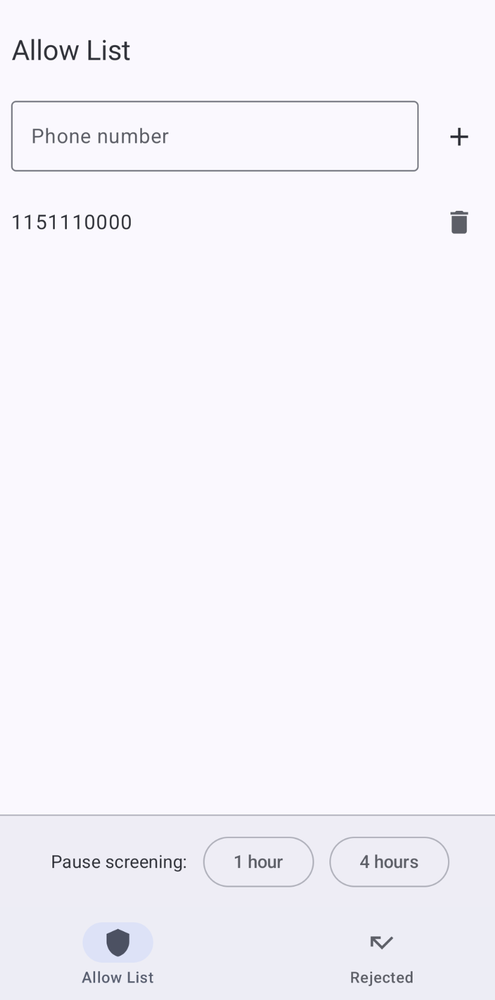
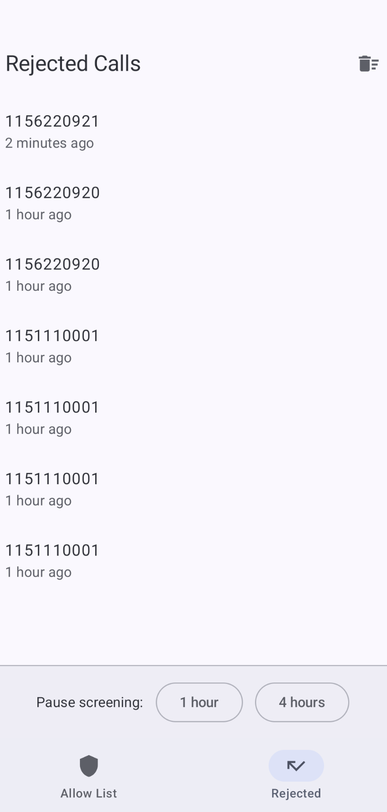
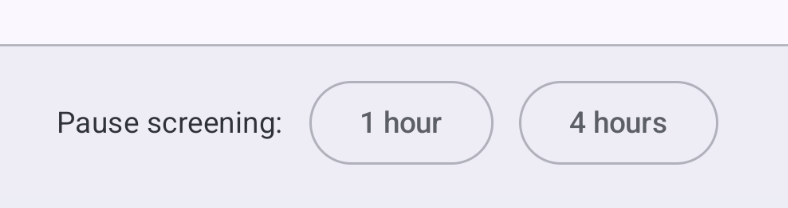
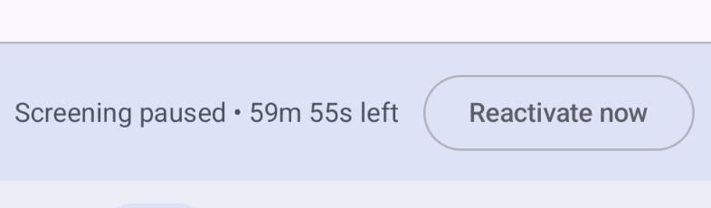

# Nexus Moderandi

A lightweight Android call screener. Incoming calls from your contacts or a custom allow-list ring through normally. Everything else is silently rejected and logged.

Built with Kotlin, Jetpack Compose, and Android's [CallScreeningService](https://developer.android.com/reference/android/telecom/CallScreeningService) API.

## How it works

When a call comes in, the app checks two things in order:

1. **Contacts** -- is the caller in your device contacts?
2. **Allow-list** -- is the number in your custom allow-list?

If either matches, the call rings through. Otherwise, the call is silently rejected (the caller hears ringing that eventually stops) and the number + timestamp are logged.

Phone number matching uses Android's `PhoneNumberUtils.compare()`, so you can add numbers in any format -- local (`912345678`), national (`11912345678`), or international (`+5511912345678`) -- and they'll all match regardless of how the carrier formats the incoming call.

## Screenshots

<p align="center">
  
  &nbsp;&nbsp;
  
</p>

### Pause screening

Expecting a delivery or a call from an unknown number? Pause screening for 1 or 4 hours. A countdown shows the remaining time, and screening reactivates automatically when the timer expires.

<p align="center">
  
</p>
<p align="center">
  
</p>

### Notification badge

A silent notification shows the number of rejected calls in the last 24 hours. Launchers that support it display this as an app icon badge.

<p align="center">
  
</p>

## Features

- Silent call rejection (no busy signal -- callers hear normal ringing)
- Allow-list with smart phone number matching (handles country codes and formatting)
- Rejected calls log with relative timestamps
- Pause screening for 1 or 4 hours with auto-reactivation
- Silent notification badge for rejected call count (last 24h)
- Persists across app restarts (Room database + DataStore)

## Requirements

- Android 10+ (API 29)
- The user must grant the **Call Screening** role to the app (prompted on first launch)

## Tech stack

- Kotlin, Jetpack Compose, Material 3
- Room (SQLite) for allow-list and call log
- DataStore for pause state
- Hilt for dependency injection
- Android CallScreeningService API

## Building

```bash
./gradlew assembleDebug
```

The debug APK will be at `app/build/outputs/apk/debug/app-debug.apk`.

## License

See [LICENSE](LICENSE) for details.
